# 🗺️ My-Tour-Planner 🌍

**My-Tour-Planner** is a smart, Flutter-powered mobile app that helps you plan your perfect trip itinerary effortlessly. Powered by AI (Gemini API) and enriched with OpenStreetMap for accurate location search, this app is your personal travel assistant — chat, search, create, edit, and bookmark your trips all in one place!

---

## ✨ Features
- ✨ **Generate Trip:** Gnerate you own personalized Trip.  
- 🤖 **AI Chatbot:** Get personalized travel suggestions and itinerary planning
- 🔍 **Location Search:** Search and explore destinations using OpenStreetMap  
- 📝 **Trip Management:** Create, edit, and manage your trip itineraries with ease  
- ⭐ **Bookmarking:** Save your favorite trips for quick access anytime
- 📃 **Download Itinerary** Download your Itinerary in PDF format
- 🔐 **User Authentication:** Secure sign-up/login with Supabase  
- 📦 **Cloud Storage:** Save your data safely using Supabase’s database and storage  
- 🎨 **Beautiful UI:** Designed with Figma for smooth and intuitive user experience  

---

## 🛠️ Tech Stack

| Technology      | Role                               |
|-----------------|----------------------------------|
| Flutter & Dart  | Frontend mobile app development   |
| Python          | Backend logic and API integration |
| Gemini API      | AI-powered chatbot & itinerary generation |
| OpenStreetMap   | Location search        |
| Supabase        | Authentication, Database & Storage|
| Figma           | UI/UX design                      |

---

## Screenshots

| Screen           | Screenshots                                   | 
|-------------------|-----------------------------------------------|
| Welcome Screens     | 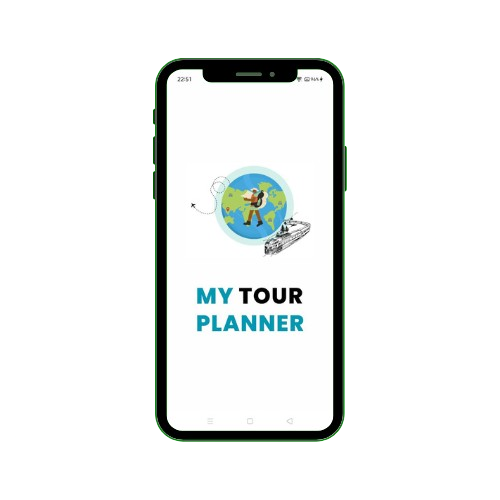   | 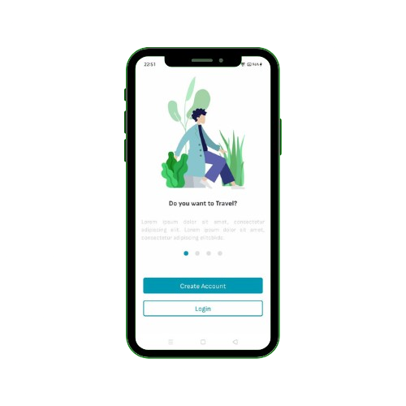 |
| Auth Screens     | 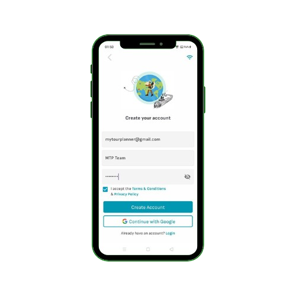   | 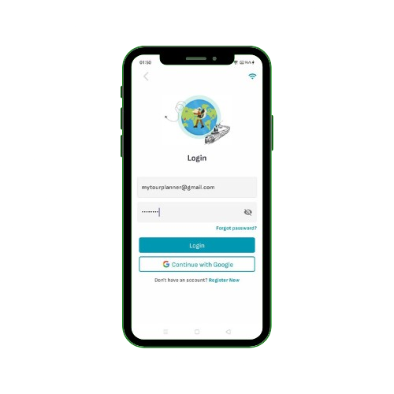 |
| Preferences Screens     | 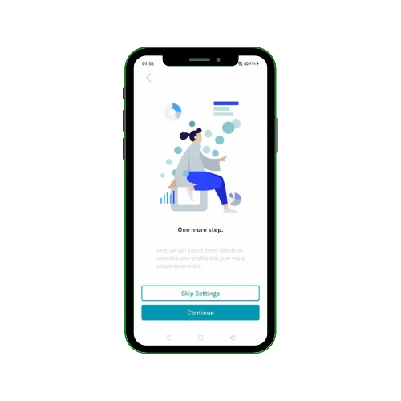   | 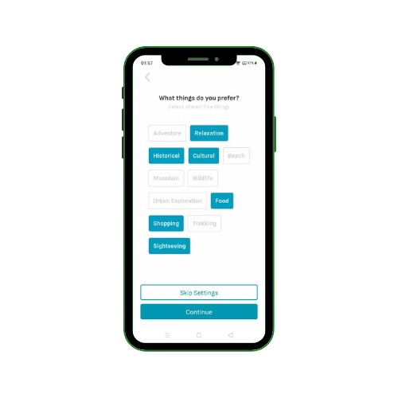 | 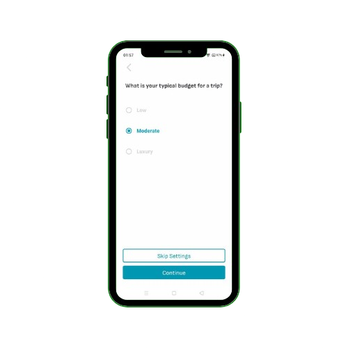 | 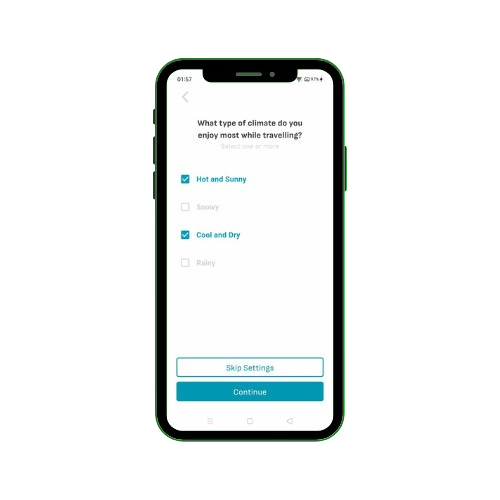 | 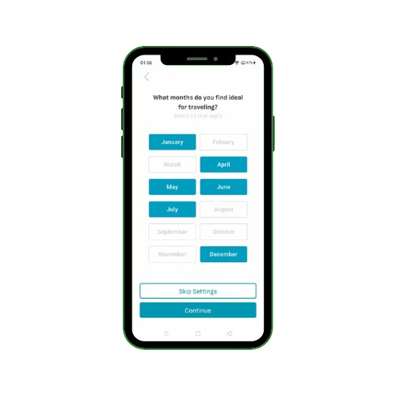 |
| Home Screens     | 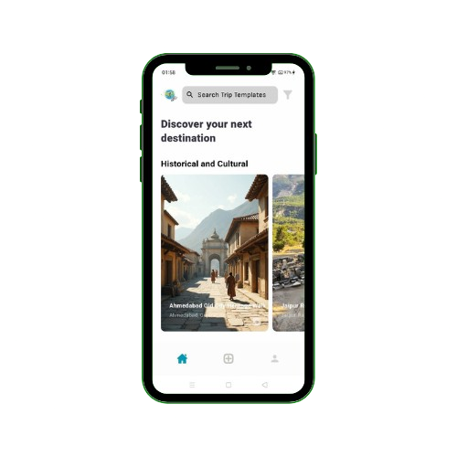   | 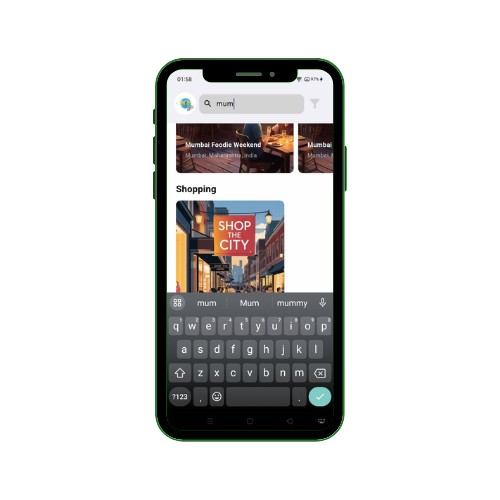 | 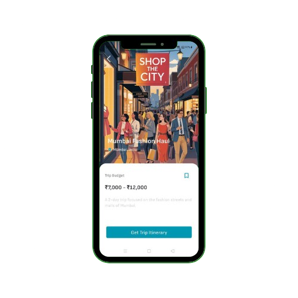 |
| MyTrips & Bookmarks    | 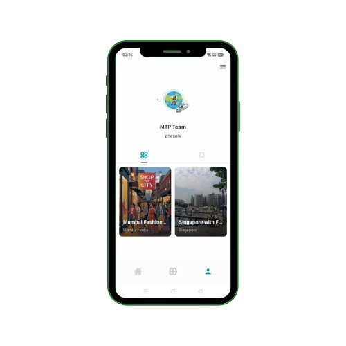   | 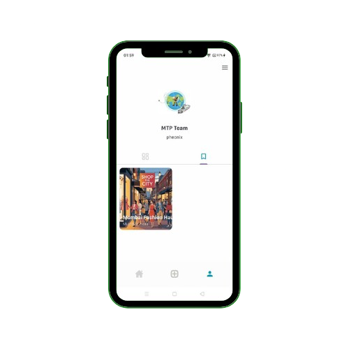 | 
| Create Itinerary    | 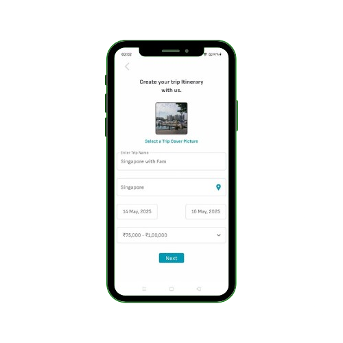   | 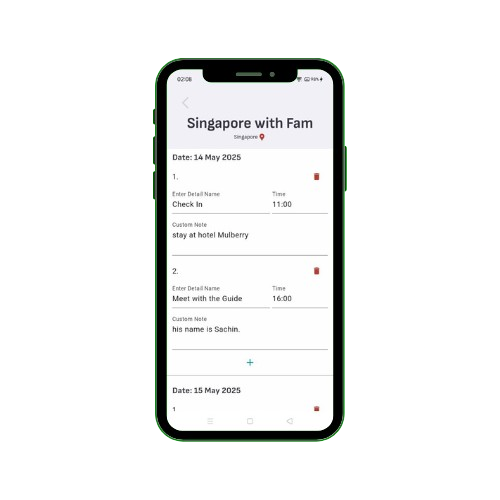 | 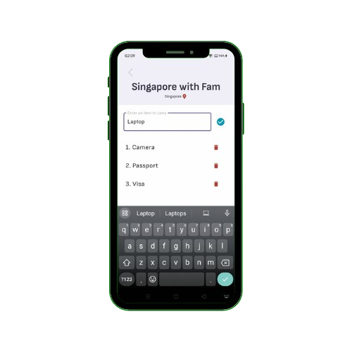 |
| Generate Itinerary    |    | 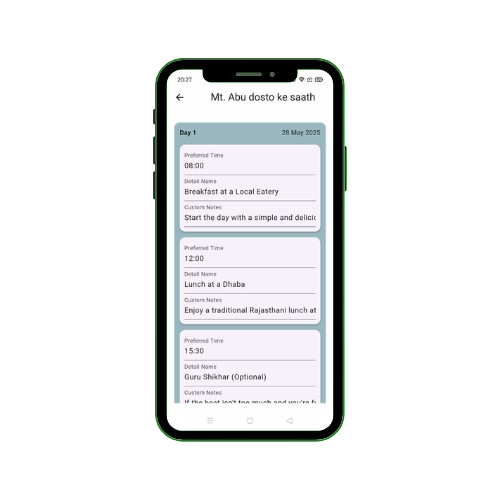 | 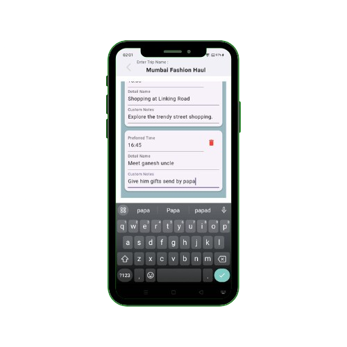 |
| Trip Planning & Chatbot   | 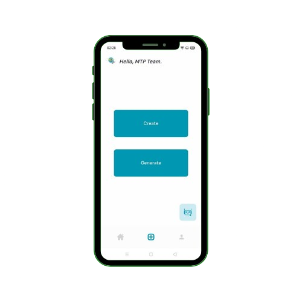   | 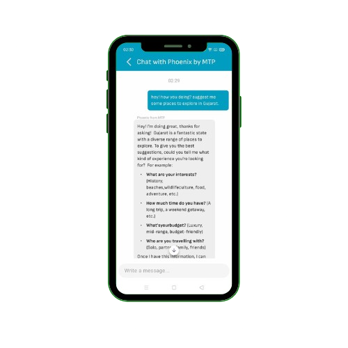 |
| Download Itinerary   | 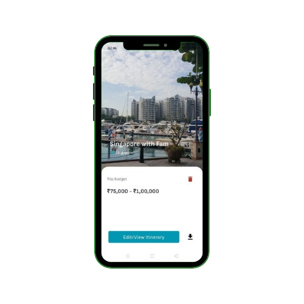   | 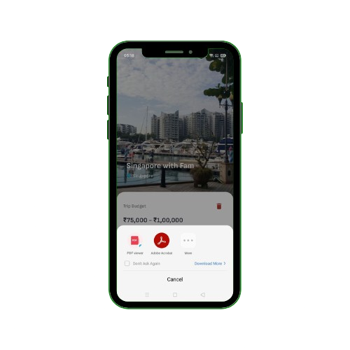 | 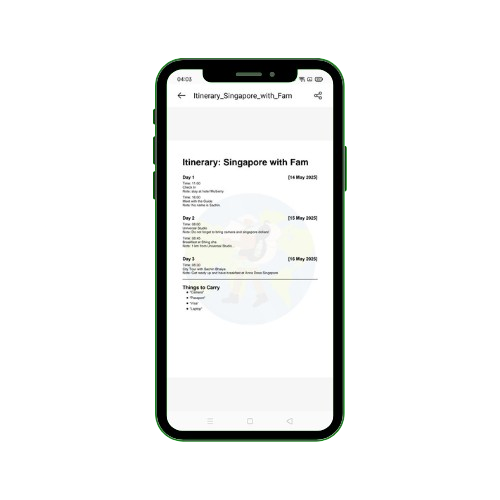 |
| Other Screens   | 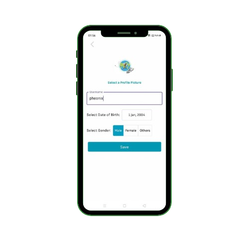   | 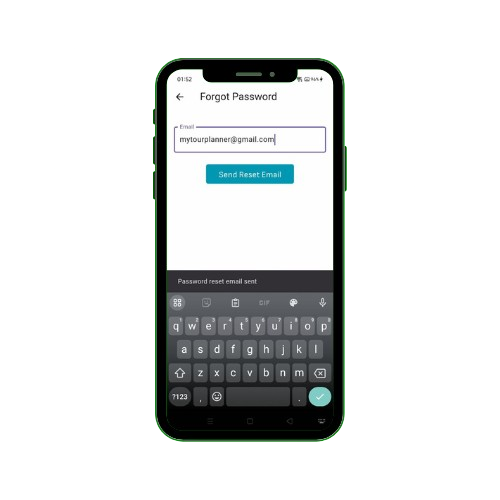 | 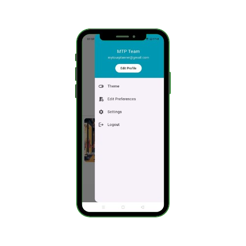 |

